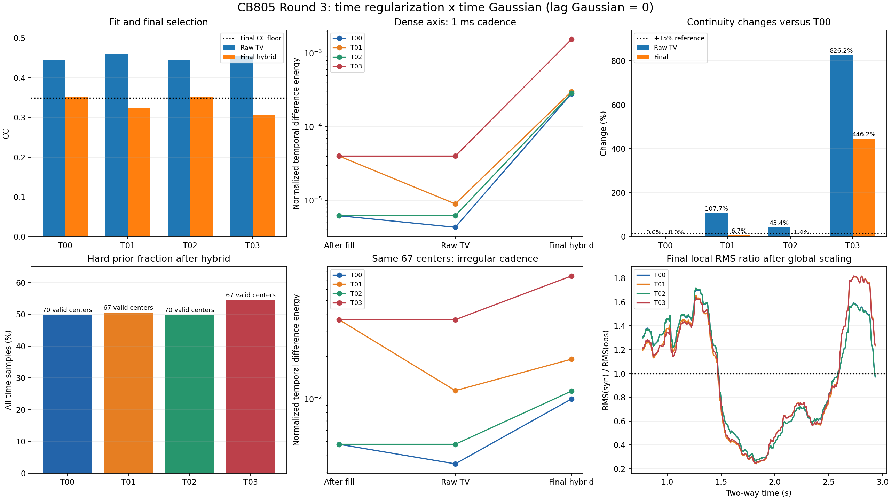

# CB805 第三轮时间去耦合验收报告

结论：四组完整主流程执行与结果一致性核验均通过。按运行前冻结的第三轮标准，保留 T00（mu_time=8、time Gaussian=30 ms）作为当前工作基线。T01、T03 不通过非劣筛选；T02 的最终输出接近 T00，但候选子波归一化时间变化超过 15%，不能宣称 time Gaussian 已被证明冗余。

## 1. 范围与复现证据

- 本轮使用用户提供的四个 YAML，均从 L02 出发：mu1=.20、mu2=6、mu_dc=0、prior=1/.8、edge=1、lag Gaussian=0。只有 mu_time（8/0）与 time_smooth_ms（30/0）变化。
- 四组均重新执行数据读取、DTW、constant-phase prior、Student-t IRLS、插值/滤波、hybrid/QC 和保存；不是用第二轮结果回放代替实验。T00 另与 L02 做复现比对。
- T00 与 L02 的全部 metrics 和 139 个可直接读取的数值数组逐元素一致；T00/T02、T01/T03 的直接中心、插值后矩阵、有效掩码和 IRLS 最终目标值分别完全一致。差异从 time Gaussian 之后开始。
- 四组 t_work、obs、DTW 反射系数、时深关系、prior 与 phase 搜索结果一致。输入 SHA-256、79 个既有源码/配置文件哈希和四个 YAML 哈希均通过核验。实际导入路径在当前仓库。
- W shape=(2546,129)，dt≈1 ms，lag=-64…64 ms；108 个计划中心，87 个进入 IRLS。四组均 87/87 收敛、使用 robust 解且目标值不增；迭代中位数为 3/4/3/4，最大均为 5。
- 本轮只新增离线验收脚本和产物；未修改核心算法或生产配置。前两轮验收口径及结果保持原记录。

## 2. 预先冻结的第三轮判据

round3_plan.json 在四组运行前保存：ΔCC_final≥-0.003；raw/hybrid W_pass 不退化；raw/final 峰值 P90≤17 ms；候选和最终的归一化时间差分能量相对 T00 增幅≤15%。IRLS 收敛和目标下降单列核验。

有效中心减少因建议未给出‘明显’的数值容忍度，采用不减少的保守提示，不隐瞒减少幅度；final edge P90≤0.15 是优选提示，不擅自改成新的核心 QC 门槛。绝对 E_t 只诊断，不用于否决。表中‘非劣筛选’与程序 W_pass 是不同判据。

E_t=mean(sum(diff(W,time)^2,lag))；归一化 E_t=E_t/(mean(sum(W^2,lag))+1e-12)。它消除整体幅度尺度影响，但仍包含相对幅度和形态变化，不等于只度量相位，也不能单独证明数值求解不稳定。

## 3. 主结果

| 实验 | mu_time / Gaussian ms | raw CC | final CC | Δfinal CC | 有效中心 | raw/final 峰 P90 ms | 非劣筛选 |
|---|---|---:|---:|---:|---:|---|---|
| T00 | 8 / 30 | 0.444446 | 0.352148 | +0.000000 | 70/108 | 14 / 2 | 通过（参照） |
| T01 | 0 / 30 | 0.459688 | 0.323667 | -0.028480 | 67/108 | 14 / 2 | 未通过 |
| T02 | 8 / 0 | 0.443934 | 0.352085 | -0.000063 | 70/108 | 14 / 2 | 未通过 |
| T03 | 0 / 0 | 0.455918 | 0.305798 | -0.046349 | 67/108 | 14 / 2 | 未通过 |

四组 raw W_pass 和 hybrid W_pass 均为 True，最终 best lag 均为 0 ms；candidate best lag 为 -1/0/-1/0 ms。注意仓库 CC_tv_direct 是验收前 hybrid 的 CC，真正未经 hybrid 的 raw CC 取 raw_tv_CC_direct。

| 实验 | 候选归一化 E_t 变化 | 最终归一化 E_t 变化 | 候选绝对 E_t 变化 | 最终绝对 E_t 变化 | final edge P90 | final side-lobe P90 |
|---|---:|---:|---:|---:|---:|---:|
| T00 | +0.00% | +0.00% | +0.00% | +0.00% | 0.146457 | 0.835680 |
| T01 | +107.67% | +6.69% | +126.16% | +11.58% | 0.147393 | 0.849936 |
| T02 | +43.37% | +1.45% | +44.00% | +2.15% | 0.147752 | 0.839693 |
| T03 | +826.23% | +446.19% | +921.49% | +446.10% | 0.138036 | 0.789007 |

T01：CC 下降 0.028480，候选归一化 E_t +107.67%，有效中心 70→67（减少 4.29%，valid_ratio 从 64.81%→62.04%）。T03：CC 下降 0.046349，候选/最终归一化 E_t 均明显超限，有效中心同样减少。二者即使不采用有效中心保守提示，也已未通过主筛选。

T02：CC 只下降 0.000063，raw/final QC、有效中心、峰位和 final edge 优选提示均通过；final 归一化 E_t 仅 +1.45%，但 candidate 为 +43.37%，故未通过完整筛选。其候选平均子波能量仅 +0.44%，这次时间变化增加不能像第二轮一样主要归因为整体能量恢复。

四组 final edge P90 均低于 0.15，final side-lobe P90 均低于 fallback 阈值 0.95。不过 raw candidate edge P90 均约 0.2138、side-lobe P90 均约 1.0961；raw W_pass 并不代表所有局部 shape 指标均处于可靠区。

## 4. 阶段去耦合证据

下表使用同一 2546 点、1 ms 全时间轴；direct centers 不混入该表。W_post_gaussian 是滤波后再去均值前快照，W_est_best 是 raw candidate。本轮两者的时间能量一致。所有 hybrid 均通过全局验收，因此 W_final_hybrid 与最终选择 W_final 一致。

| 实验 | 插值后归一化 E_t | Gaussian/去均值后归一化 E_t | hybrid 后归一化 E_t |
|---|---:|---:|---:|
| T00 | 6.192688e-06 | 4.319403e-06 | 0.0002821263 |
| T01 | 4.00074e-05 | 8.970271e-06 | 0.0003009922 |
| T02 | 6.192688e-06 | 6.192688e-06 | 0.000286204 |
| T03 | 4.00074e-05 | 4.00074e-05 | 0.001540938 |

另按四组共同的 67 个有效中心对齐：中心时间间隔中位数 20 ms，最大缺口 420 ms。直接反演归一化 E_t 从 mu_time=8 时的 0.00476155 增至 mu_time=0 时的 0.03644679（+665.44%）。这是相同中心支撑下的证据，不能归咎于 70 与 67 个中心的统计口径差异。稀疏中心 E_t 未除以时间间隔平方，不与 1 ms 稠密结果直接比较数值大小。

T02 在共同中心的 candidate 归一化 E_t 相对 T00 仍 +37.57%，final 为 +13.68%；全轴 final 的 +1.45% 因支撑不同而较小。最终全轴统计会受 prior 区和 hybrid 混合影响，不能由 final 接近就推断 candidate 接近。

mu_time 的作用无法被 30 ms Gaussian 完全替代：Gaussian 开启时去掉 mu_time，final CC 下降 0.028480；Gaussian 关闭时下降 0.046287。反过来，在 mu_time 已开启时去掉 Gaussian，final CC 几乎不变；在 mu_time 关闭时去掉 Gaussian，final CC 再下降 0.017869。两因素存在相互作用。

T03 的 hard-prior 比例为 54.36%，高于 T00 的 49.65%，即使其 final edge/side-lobe 更低也不意味着 raw 反演更好。hybrid 阶段会改变幅度、形态与支撑连续性；本轮只定位阶段差异，没有将差分能量增加一概解释为噪声或 IRLS 发散。

## 5. 幅度诊断

以原非平稳正演计算 RMS(s_syn)/RMS(s_obs)，并区分实际全局 match_rms 前后。局部窗口 387 samples，只统计 2160 个完整窗口，不补零；没有观测 RMS 为零的窗口。全局标定后的四组 RMS 比例均约为 1，不能据此认定局部幅度无差异。

| 实验 | final 标定前全局 RMS 比 | final 标定后局部 RMS 比 P10 / P50 / P90 |
|---|---:|---|
| T00 | 0.218566 | 0.3487 / 0.9644 / 1.5543 |
| T01 | 0.237883 | 0.3137 / 0.9020 / 1.6358 |
| T02 | 0.219065 | 0.3479 / 0.9629 / 1.5522 |
| T03 | 0.235206 | 0.3206 / 0.8947 / 1.6216 |

## 6. 验收决定与后续边界

1. 执行验收：4/4 完整运行成功，冻结条件、快照、正演/CC 和 IRLS 核验通过。
2. 模型筛选：保留 mu_time=8。按预先冻结的 candidate+final 连续性判据，本轮也暂保留 time_smooth_ms=30；继续使用 T00/L02 的参数结构，不直接升级 T02。
3. T02 是值得保留的简化候选：最终产物性能已接近，但完整非劣证据不足。如果之后允许改变连续性验收范围，应先明确新的物理理由和规则，再做独立验证；本报告不在看到结果后放宽 15% 来宣布通过。
4. 按你的顺序，下一轮可在当前 T00 参数结构上做 mu1=0/.05/.1/.2/.4 强度扫描。这些实验尚未在本轮执行。当前结论仅针对 CB805 的这份固定输入，没有噪声重采样或跨井统计置信区间。

## 7. 文件和复算

- 原始输入配置：本目录 T00–T03 四个 YAML，未改写。
- 各组子目录：metrics.json、result_bundle.npz、config_used.yaml、日志及 17 张原流程诊断图。
- round3_plan.json：运行前标准、输入/源码/配置哈希。
- time_summary.csv：原矩阵脚本汇总；time_acceptance.json：分阶段/共同中心/幅度与门槛明细。
- time_console.log / time_acceptance_checks.log：完整运行和离线核验日志。
- rms_profiles.npz / time_overview.png：幅度剖面与本轮对照图。
- 仓库根目录执行 `D:/miniconda/envs/myenv/python.exe -B experiments/check_time_ablation.py` 可复算验收；再执行本目录 render_time_report.py 可重建报告和图。

