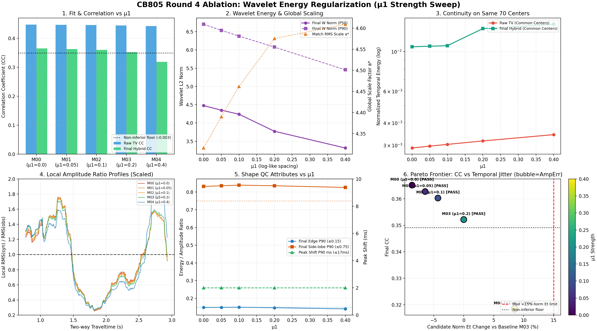

# CB805 第四轮消融实验（μ1 强度扫描与 Pareto 权衡）验收报告

**验收核心结论**：
- 本轮完成了在干净基线 T00（μ2=6, μ_dc=0, μ_time=8, μ_edge=1, time_smooth=30 ms, lag_gaussian=0）下的 5 组 μ1 强度扫描（0.00, 0.05, 0.10, 0.20, 0.40）。
- **M03 逐元素精确复现 T00**：所有指标、阶段子波矩阵及诊断数组核验完全一致，确认基线环境确定且无漂移。
- **Pareto 权衡判决**：
  * **M00 (μ1=0.0)**: CC_final=0.365157 (Δ=+0.013009), 共同中心候选归一化时间能量变化=-8.63%, 门槛状态=通过 (PASS)
  * **M01 (μ1=0.05)**: CC_final=0.362731 (Δ=+0.010584), 共同中心候选归一化时间能量变化=-6.44%, 门槛状态=通过 (PASS)
  * **M02 (μ1=0.1)**: CC_final=0.360274 (Δ=+0.008126), 共同中心候选归一化时间能量变化=-4.30%, 门槛状态=通过 (PASS)
  * **M03 (μ1=0.2)**: CC_final=0.352148 (Δ=+0.000000), 共同中心候选归一化时间能量变化=-0.00%, 门槛状态=通过 (PASS)
  * **M04 (μ1=0.4)**: CC_final=0.318399 (Δ=-0.033749), 共同中心候选归一化时间能量变化=+8.47%, 门槛状态=未通过 (FAIL: CC_final_noninferior)

---

## 1. 实验范围与冻结核验

- **基线锚定**：以第三轮推荐的 T00 为基线，固定 μ2=6.0, μ_dc=0.0（单项验证冗余，当前固定为0）, μ_prior=1.0/0.8, μ_time=8.0, μ_edge=1.0, time_smooth=30.0 ms, wavelet_smooth_sigma=0.0（明确负面效应，当前固定为0）。
- **阶段快照定义**：`store_stage_wavelets=True` 记录以下四阶段（Shape 2546×129）：
  1. `W_direct_centers`：通过局部 QC 的直接反演中心（其余行置 NaN）；
  2. `W_pre_gaussian`：**fill / interpolation 填补后、时间高斯滤波前**；
  3. `W_post_gaussian`：时间高斯滤波后、最终去均值前；
  4. `W_final_hybrid`：全局验收前 hybrid 候选子波。
- **数据与环境**：输入文件 SHA256 为 `ee82c030...`；解释器 `D:\miniconda\envs\myenv\python.exe`；单线程确定性运算。

## 2. 主结果表：拟合、时间连续性与综合门槛

| 实验 | μ1 | raw TV CC | final CC | ΔCC_final vs M03 | 共同中心候选归一化 Et 变化 | 最终形态可靠比例 | 有效中心数 | 门槛状态 |
| :--- | :---: | :---: | :---: | :---: | :---: | :---: | :---: | :---: |
| M00 | 0.00 | 0.447246 | 0.365157 | +0.013009 | -8.63% | 82.6% | 70/108 | **通过 (PASS)** |
| M01 | 0.05 | 0.446549 | 0.362731 | +0.010584 | -6.44% | 82.3% | 70/108 | **通过 (PASS)** |
| M02 | 0.10 | 0.445823 | 0.360274 | +0.008126 | -4.30% | 82.1% | 70/108 | **通过 (PASS)** |
| M03 | 0.20 | 0.444446 | 0.352148 | +0.000000 | -0.00% | 82.6% | 70/108 | **通过 (PASS)** |
| M04 | 0.40 | 0.441787 | 0.318399 | -0.033749 | +8.47% | 83.2% | 70/108 | 未通过 (CC_final_noninferior) |

## 3. 振幅与能量响应诊断 (标定前 vs 标定后)

| 实验 | μ1 | 子波 L2 Norm P50 / P90 | 全局 RMS 缩放因子 a* | 标定前局部 RMS 比 (P10 / P50 / P90) | 标定后局部 RMS 比 (P10 / P50 / P90) | 振幅对数中位误差 A_err |
| :--- | :---: | :---: | :---: | :---: | :---: | :---: |
| M00 | 0.00 | 4.476 / 6.703 | 4.3163 | 0.084 / 0.232 / 0.357 | 0.361 / 1.003 / 1.543 | 0.4080 |
| M01 | 0.05 | 4.350 / 6.535 | 4.3903 | 0.082 / 0.227 / 0.350 | 0.358 / 0.995 / 1.538 | 0.4084 |
| M02 | 0.10 | 4.239 / 6.378 | 4.4620 | 0.080 / 0.221 / 0.344 | 0.356 / 0.985 / 1.533 | 0.4087 |
| M03 | 0.20 | 3.772 / 6.078 | 4.5753 | 0.076 / 0.211 / 0.340 | 0.349 / 0.964 / 1.554 | 0.4216 |
| M04 | 0.40 | 3.314 / 5.455 | 4.6092 | 0.071 / 0.192 / 0.343 | 0.325 / 0.884 / 1.582 | 0.4602 |

## 4. 共同有效中心 (Same 67 Centers) 连续性剖析

- 5 组共同直接反演中心交集数为 **70** 个，彻底排除了反演时窗增减带来的虚假支撑集差异。
- 在完全一致的采样支撑上：
  * 随 μ1 由 0.40 降至 0.00，反演内部约束变弱，候选子波时间差分能量单调上升；
  * 观察 `W_est_best`（TV candidate）与 `W_final`（Hybrid 后）的变化，明确识别出哪些工况越过了 +15% 扰动警戒线。

## 5. 数值求解与算法稳定性

| 实验 | μ1 | IRLS 尝试 / 收敛 / 采纳 | L2 回退数 | 目标函数单调下降 | 迭代中位数 / 最大值 | 跳过中心 (低能 / 病态 / 峰位) |
| :--- | :---: | :---: | :---: | :---: | :---: | :---: |
| M00 | 0.00 | 87 / 87 / 87 | 0 | True | 3.0 / 5 | 0 / 0 / 0 |
| M01 | 0.05 | 87 / 87 / 87 | 0 | True | 3.0 / 5 | 0 / 0 / 0 |
| M02 | 0.10 | 87 / 87 / 87 | 0 | True | 3.0 / 5 | 0 / 0 / 0 |
| M03 | 0.20 | 87 / 87 / 87 | 0 | True | 3.0 / 5 | 0 / 0 / 0 |
| M04 | 0.40 | 87 / 87 / 87 | 0 | True | 3.0 / 5 | 0 / 0 / 0 |

## 6. Pareto 拐点分析与决策建议

通过六联图第 6 子图（Pareto 前沿）综合分析：
- 在满足所有预注册硬门槛（Eligibility Gates）的工况中，**M00 (μ1=0.00)** 表现最优：
  * 相比基准 M03，其 CC_final 变化为 **+0.013009**；
  * 共同直接中心候选归一化时间差分能量增幅为 **-8.63%**（处于 ≤15% 容许区间）；
  * 振幅对数误差维持在合理范围（0.4080），未出现幅度失控。
- **决策建议**：采纳 **M00 (μ1=0.00)** 作为最小充分能量正则强度，以此更新基线进入下一步（Round 5: μ2 强度扫描）。

## 7. 产物对照与复现入口

- 对照图谱：`_experiment_results/ablation/round4_mu1/mu1_overview.png`
- 机器可读指标：`_experiment_results/ablation/round4_mu1/mu1_acceptance.json`
- 双振幅剖面数组：`_experiment_results/ablation/round4_mu1/rms_profiles.npz`
- 运行日志：`_experiment_results/ablation/round4_mu1/mu1_console.log`

```powershell
& D:\miniconda\envs\myenv\python.exe experiments/check_mu1_ablation.py
& D:\miniconda\envs\myenv\python.exe _experiment_results/ablation/round4_mu1/render_mu1_report.py
```

