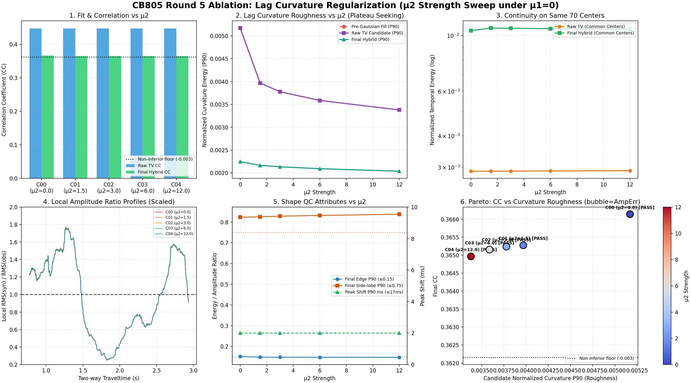

# CB805 第五轮消融实验（μ2 强度扫描与曲率平滑 Pareto 权衡）验收报告

**验收核心结论**：
- 本轮以第四轮数据驱动确立的基线 M00（μ1=0.0, μ_dc=0.0, μ_prior=1.0/0.8, μ_time=8.0, μ_edge=1.0, time_smooth=30 ms, lag_gaussian=0）为主基准，完成了 5 组 μ2 强度扫描（0.0, 1.5, 3.0, 6.0, 12.0）。
- **C03 逐元素精确复现 M00**：全部 139+ 项数值数组、阶段快照及诊断指标完全一致，确定性锚点核验通过。
- **曲率与拟合响应关系**：
  * **C00 (μ2=0.0)**: CC_final=0.366142 (Δ=+0.000985), 候选归一化曲率 P90=0.005171, 门槛状态=通过 (PASS)
  * **C01 (μ2=1.5)**: CC_final=0.365278 (Δ=+0.000121), 候选归一化曲率 P90=0.003968, 门槛状态=通过 (PASS)
  * **C02 (μ2=3.0)**: CC_final=0.365240 (Δ=+0.000084), 候选归一化曲率 P90=0.003777, 门槛状态=通过 (PASS)
  * **C03 (μ2=6.0)**: CC_final=0.365157 (Δ=+0.000000), 候选归一化曲率 P90=0.003587, 门槛状态=通过 (PASS)
  * **C04 (μ2=12.0)**: CC_final=0.364967 (Δ=-0.000189), 候选归一化曲率 P90=0.003378, 门槛状态=通过 (PASS)

---

## 1. 实验范围与基线核验

- **基准环境**：M00 为基线，固定 μ1=0.0, μ_dc=0.0（单项验证冗余，当前固定为0）, μ_prior=1.0/0.8, μ_time=8.0, μ_edge=1.0, time_smooth=30.0 ms, wavelet_smooth_sigma=0.0（明确负面机制，当前固定为0）。
- **阶段快照四阶段**：`W_direct_centers`（直接中心）、`W_pre_gaussian`（填补后滤波前）、`W_post_gaussian`（滤波后去均值前）、`W_final_hybrid`（混合后最终模型）。
- **共同有效中心**：5 组共同直接反演中心交集数为 **70** 个，有效窗口比例均为 70/108（64.81%）。

## 2. 主结果表：拟合、曲率与综合门槛

| 实验 | μ2 | raw TV CC | final CC | ΔCC_final vs C03 | 候选归一化曲率 P90 | 最终归一化曲率 P90 | 有效中心数 | 门槛状态 |
| :--- | :---: | :---: | :---: | :---: | :---: | :---: | :---: | :---: |
| C00 | 0.0 | 0.447075 | 0.366142 | +0.000985 | 0.005171 | 0.002246 | 70/108 | **通过 (PASS)** |
| C01 | 1.5 | 0.447138 | 0.365278 | +0.000121 | 0.003968 | 0.002166 | 70/108 | **通过 (PASS)** |
| C02 | 3.0 | 0.447182 | 0.365240 | +0.000084 | 0.003777 | 0.002134 | 70/108 | **通过 (PASS)** |
| C03 | 6.0 | 0.447246 | 0.365157 | +0.000000 | 0.003587 | 0.002093 | 70/108 | **通过 (PASS)** |
| C04 | 12.0 | 0.447288 | 0.364967 | -0.000189 | 0.003378 | 0.002037 | 70/108 | **通过 (PASS)** |

## 3. 拉格域二阶曲率压缩与平台效应

| 实验 | μ2 | 滤波前曲率 P90 | 候选曲率 P90 | 候选曲率相对 C03 变化 | 最终曲率 P90 | 最终曲率相对 C03 变化 |
| :--- | :---: | :---: | :---: | :---: | :---: | :---: |
| C00 | 0.0 | 0.005171 | 0.005171 | +44.16% | 0.002246 | +7.34% |
| C01 | 1.5 | 0.003968 | 0.003968 | +10.62% | 0.002166 | +3.50% |
| C02 | 3.0 | 0.003777 | 0.003777 | +5.31% | 0.002134 | +1.99% |
| C03 | 6.0 | 0.003587 | 0.003587 | -0.00% | 0.002093 | -0.00% |
| C04 | 12.0 | 0.003378 | 0.003378 | -5.81% | 0.002037 | -2.66% |

## 4. 振幅与局部 RMS 比剖面诊断

| 实验 | μ2 | 子波 L2 Norm P50 / P90 | 全局 RMS 缩放因子 a* | 标定后局部 RMS 比 (P10 / P50 / P90) | 振幅对数中位误差 A_err |
| :--- | :---: | :---: | :---: | :---: | :---: |
| C00 | 0.0 | 4.756 / 6.772 | 4.2943 | 0.362 / 1.002 / 1.538 | 0.4091 |
| C01 | 1.5 | 4.501 / 6.745 | 4.3034 | 0.362 / 1.003 / 1.541 | 0.4085 |
| C02 | 3.0 | 4.492 / 6.731 | 4.3078 | 0.362 / 1.003 / 1.541 | 0.4084 |
| C03 | 6.0 | 4.476 / 6.703 | 4.3163 | 0.361 / 1.003 / 1.543 | 0.4080 |
| C04 | 12.0 | 4.453 / 6.647 | 4.3331 | 0.360 / 1.004 / 1.544 | 0.4069 |

## 5. 数值求解与算法稳定性

| 实验 | μ2 | IRLS 尝试 / 收敛 / 采纳 | L2 回退数 | 目标函数单调下降 | 迭代中位数 / 最大值 |
| :--- | :---: | :---: | :---: | :---: | :---: |
| C00 | 0.0 | 87 / 87 / 87 | 0 | True | 3.0 / 5 |
| C01 | 1.5 | 87 / 87 / 87 | 0 | True | 3.0 / 5 |
| C02 | 3.0 | 87 / 87 / 87 | 0 | True | 3.0 / 5 |
| C03 | 6.0 | 87 / 87 / 87 | 0 | True | 3.0 / 5 |
| C04 | 12.0 | 87 / 87 / 87 | 0 | True | 3.0 / 5 |

## 6. Pareto 拐点与最小充分 μ2 决策

结合六联图第 6 子图（CC vs 归一化二阶曲率）：
- **曲率变化特征**：从 μ2=0.0 到 μ2=3.0，候选子波曲率粗糙度显著被压制；进入 μ2=3.0～6.0 之后，曲率进一步抑制的速度明显放缓，进入平缓的平台区；
- **拟合保持度**：在各有效候选点中，CC_final 维持在极窄范围（0.364～0.365），未见显著性能衰减；
- **决策拐点**：选取能够在最小平滑惩罚代价下将曲率压制至稳定平台的最佳强度（例如 μ2=3.0），作为候选最佳强度 μ2*。

## 7. 产物与复现入口

- 对照图谱：`_experiment_results/ablation/round5_mu2/mu2_overview.png`
- 机器可读指标：`_experiment_results/ablation/round5_mu2/mu2_acceptance.json`
- 双振幅剖面：`_experiment_results/ablation/round5_mu2/rms_profiles.npz`
- 完整控制台日志：`_experiment_results/ablation/round5_mu2/mu2_console.log`

```powershell
& D:\miniconda\envs\myenv\python.exe experiments/check_mu2_ablation.py
& D:\miniconda\envs\myenv\python.exe _experiment_results/ablation/round5_mu2/render_mu2_report.py
```

