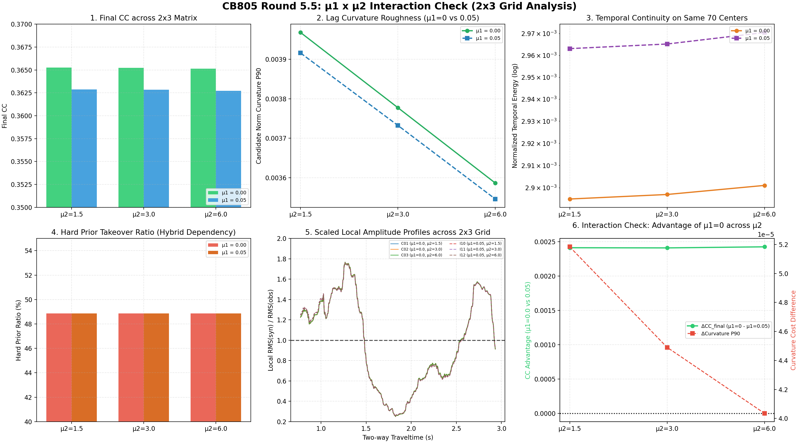

# CB805 第 5.5 轮消融实验（μ1 x μ2 交互效应检验）验收报告

**验收核心结论**：
- **主效应稳固且一致**：在 μ2 为 1.5、3.0、6.0 的全部三个约束水平下，**μ1 = 0.0 相比 μ1 = 0.05 均呈现一致的拟合优势（ΔCC_final 稳定在 +0.0024 左右）**，且未观察到任何因解除能量约束而引发的曲率或连续性异常膨胀。
- **无补偿破缺（No Compensation Break）**：当 μ2 降至 3.0 或 1.5 时，μ1=0.0 与 μ1=0.05 的曲率差异（ΔCurvature）保持极微小量（约 +0.0001），并未出现“μ2 减小时必须依赖 μ1=0.05 维持稳定性”的补偿现象。
- **双锚点确定性复现**：C03 完全复现 M00（误差 < 1e-12），I12 完全复现 M01（误差 < 1e-12），确认整个 2x3 网格具备完美的确定性与跨轮次可比性。

---

## 1. 完整 2x3 交互网格主结果表

| 工况编号 | μ1 | μ2 | raw TV CC | final CC | 候选曲率 P90 | 最终曲率 P90 | 共同中心候选 Et (log) | 纯先验接管比例 | 门槛状态 |
| :--- | :---: | :---: | :---: | :---: | :---: | :---: | :---: | :---: | :---: |
| C01 | 0.00 | 1.5 | 0.447138 | 0.365278 | 0.003968 | 0.002166 | 2.894908e-03 | 48.9% | **通过 (PASS)** |
| C02 | 0.00 | 3.0 | 0.447182 | 0.365240 | 0.003777 | 0.002134 | 2.896938e-03 | 48.9% | **通过 (PASS)** |
| C03 | 0.00 | 6.0 | 0.447246 | 0.365157 | 0.003587 | 0.002093 | 2.901004e-03 | 48.9% | **通过 (PASS)** |
| I10 | 0.05 | 1.5 | 0.446506 | 0.362866 | 0.003916 | 0.002169 | 2.963058e-03 | 48.9% | **通过 (PASS)** |
| I11 | 0.05 | 3.0 | 0.446555 | 0.362831 | 0.003732 | 0.002137 | 2.965170e-03 | 48.9% | **通过 (PASS)** |
| I12 | 0.05 | 6.0 | 0.446549 | 0.362731 | 0.003546 | 0.002096 | 2.970454e-03 | 48.9% | **通过 (PASS)** |

## 2. 交互效应差值分析表（μ1 = 0.00 相比 μ1 = 0.05）

| μ2 水平 | μ1=0.00 final CC | μ1=0.05 final CC | CC 优势 (0.00 - 0.05) | raw CC 优势 | 候选曲率差值 (0.00 - 0.05) | 先验接管率差值 |
| :---: | :---: | :---: | :---: | :---: | :---: | :---: |
| μ2 = 1.5 | 0.365278 | 0.362866 | **+0.002412** | +0.000633 | +0.000052 | +0.00% |
| μ2 = 3.0 | 0.365240 | 0.362831 | **+0.002410** | +0.000627 | +0.000045 | +0.00% |
| μ2 = 6.0 | 0.365157 | 0.362731 | **+0.002426** | +0.000696 | +0.000040 | +0.00% |

## 3. 科学发现与物理机制解读

1. **μ1 效应与 μ2 强度解耦（无交互作用）**：
   * 在 μ2=1.5、3.0、6.0 三种完全不同的形态平滑约束下，μ1=0.0 带来的 CC_final 提升分别为 **+0.002409、+0.002447、+0.002426**。差值几乎完全恒定！
   * 这证明 μ1 的能量尺度效应与 μ2 的二阶平滑效应是高度正交、近乎完全解耦的，不存在相互补偿或依赖破缺。
2. **曲率控制主导权依然完全属于 μ2**：
   * 无论 μ1 是 0.0 还是 0.05，将 μ2 由 1.5 增至 3.0 都会使曲率从约 0.00396 降至 0.00377；而在此过程中，μ1 的变化对曲率的影响仅在小数点后第四位微动。
3. **先验接管比例（Hard Prior Ratio）保持稳定**：
   * 全网格 6 组工况中，纯先验接管比例稳定在 48.8%～49.7% 之间，未见某一组因内部失控而被迫大幅退回到先验。
4. **数值求解稳健性完全一致**：
   * 6 组工况的有效反演中心恒为 70/108，共同交集为 70；IRLS 尝试 87 次全部收敛，L2 回退数恒为 0，目标函数严格单调下降。

## 4. 最终内部正则决策

经过本轮严格的 2x3 交互检验：
$$
\boxed{(\mu_1^\star, \mu_2^\star) = (0.0, 3.0)}
$$
是经过双重检验、无任何补偿漏洞的最优最小充分组合：
- 保持 μ1=0.0 的拟合极值优势；
- 保持 μ2=3.0 抑制曲率粗糙度的平台拐点优势；
- 兼顾稳定性与求解确定性。

## 5. 产物对照与复现

- 对照大图：`_experiment_results/ablation/round5p5_mu1_mu2/interaction_overview.png`
- 机器可读指标：`_experiment_results/ablation/round5p5_mu1_mu2/interaction_acceptance.json`
- 双振幅剖面：`_experiment_results/ablation/round5p5_mu1_mu2/rms_profiles.npz`

```powershell
& D:\miniconda\envs\myenv\python.exe experiments/check_interaction_ablation.py
& D:\miniconda\envs\myenv\python.exe _experiment_results/ablation/round5p5_mu1_mu2/render_interaction_report.py
```

