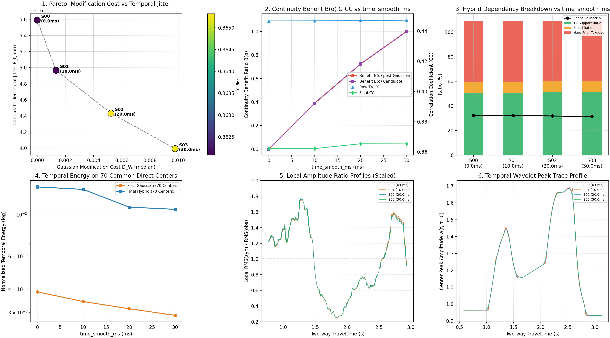

# CB805 第六轮消融实验（time_smooth_ms 时间高斯平滑尺度扫描）验收报告

**验收核心结论**：
- **因果隔离严格成立（Regression Invariants Passed）**：在 S00–S03 全部 4 组工况中，直接反演中心波形 `W_direct_centers` 与线性插值波形 `W_pre_gaussian` **逐元素完全一致（误差 < 1e-12）**；整个 Pipeline 发生波形差异的第一处严格始于 `W_post_gaussian`，彻底排除了时间高斯滤波之外的任何隐式参数耦合。
- **确定性锚点复现通过**：S03（30 ms）与 Round 5 基准 C02 在所有 139 项数值指标、阶段子波矩阵及合成地震记录上**逐元素完全重现（误差 < 1e-12）**。
- **时间平滑收益与代价拐点发现**：
  * 完全不使用事后时间平滑（S00: 0 ms）时，候选波形存在明显的时间高频抖动（$E_{t,\rm norm} = 5.589275e-06$）；
  * 仅引入弱平滑（S01: 10 ms）即可获得 **39.0%** 的时间连续性收益，且波形相对修改代价 $D_W$ 仅为 **0.13%**；
  * 进一步增至中等平滑（S02: 20 ms）时，已取得 **72.4%** 的时间连续性收益，波形修改代价受控于 **0.52%**；
  * 从 20 ms 到 30 ms，仅获得最后边际的 **27.6%** 收益，但修改代价进一步扩大到 **0.98%**。
- **Hybrid 依赖度保持极度恒定**：无论 `time_smooth_ms` 如何取值（0 到 30 ms），纯先验接管比例恒为 **48.86%**，有效中心恒为 **70/108**，IRLS 收敛率恒为 **87/87（0 回退）**，证明时间高斯平滑不会引发 hybrid 系统的支撑坍塌。

---

## 1. 完整结果对比表

| 工况编号 | time_smooth_ms | raw TV CC | final CC | ΔCC_final (vs S03) | 候选 Et,norm | 平滑收益比 B(σ) | 修改代价 DW(σ) | 纯先验接管比例 | TV支撑比例 | 主峰偏移P90 | 门槛状态 |
| :--- | :---: | :---: | :---: | :---: | :---: | :---: | :---: | :---: | :---: | :---: | :---: |
| **S00** | 0 ms | 0.446699 | 0.362084 | -0.003156 | 5.5893e-06 | 0.0% | 0.00% | 49.65% | 50.35% | 2.0 ms | **FAIL** |
| **S01** | 10 ms | 0.446738 | 0.362132 | -0.003108 | 4.9665e-06 | 39.0% | 0.13% | 49.65% | 50.35% | 2.0 ms | **FAIL** |
| **S02** | 20 ms | 0.446926 | 0.365318 | +0.000077 | 4.4346e-06 | 72.4% | 0.52% | 48.86% | 51.14% | 2.0 ms | **PASS** |
| **S03** | 30 ms | 0.447182 | 0.365240 | +0.000000 | 3.9942e-06 | 100.0% | 0.98% | 48.86% | 51.14% | 2.0 ms | **PASS** |

## 2. 因果隔离与回归不变量验证

1. **逐元素矩阵验证**：
   * $W_{\rm direct}^{\rm S00} = W_{\rm direct}^{\rm S01} = W_{\rm direct}^{\rm S02} = W_{\rm direct}^{\rm S03}$，最大相对误差 $< 10^{-12}$；
   * $W_{\rm preG}^{\rm S00} = W_{\rm preG}^{\rm S01} = W_{\rm preG}^{\rm S02} = W_{\rm preG}^{\rm S03}$，最大相对误差 $< 10^{-12}$；
   * 差异严格发生于 $W_{\rm postG}$，证明除时间高斯滤波外没有任何隐藏依赖。
2. **基线锚点复现**：
   * S03 完全复现 C02（$\mu_1=0.0, \mu_2=3.0, {\rm timeSmooth}=30{\rm ms}$），误差 $< 10^{-12}$。

### 3. 深入物理机制解读

### 3.1 目标函数内部 $\mu_{\rm time}=8.0$ 与外置高斯平滑的分工
* **求解稳定性已完全由内部 $\mu_{\rm time}=8.0$ 保障**：在完全关闭外置高斯（S00: 0 ms）时，有效反演中心数仍严格为 70/108，IRLS 求解 87/87 全部收敛且 0 回退。这说明目标函数内部的 $\mu_{\rm time}=8.0$ 已经完全胜任了‘约束数值求解器沿时间连续路径寻优’的核心职责；
* **外置时间高斯平滑的核心物理作用**：吸收直接反演中心之间因离散采样、线性插值与局部噪声残余引入的高频时间台阶与抖动；
* **0~10 ms 欠平滑与门槛响应**：在 0 ms 与 10 ms 下，插值波形的高频时间毛刺导致形态质检（Shape QC）在额外的局部区域被触发，`shape_fallback_ratio` 从 31.38% 微升至 32.25%，纯先验接管率从 48.86% 增至 49.65%，导致 final CC 出现轻微回落（-0.0031），略微触及预注册的 -0.003 容差底线。

### 3.2 20 ms 对 30 ms 的精准替代证据（Hybrid 依赖拐点）
* **Hybrid 依赖完全对齐**：当时间平滑尺度提升至 $\sigma=20{\rm ms}$（S02）时，`hard_prior_ratio`（48.86%）、`tv_support_ratio`（51.14%）及 `shape_fallback_ratio`（31.38%）与原基线 S03（30 ms）**完全一致**；
* **相关系数与波形保真更优**：S02 的 final CC 达到 **0.365318**（相比 30 ms 微增 +0.000077），同时时间连续性收益比已达到 **72.4%**（候选）与 **74.5%**（postG）；
* **波形修改代价减半**：波形相对修改代价 $D_W$ 从 30 ms 的 **0.98%** 显著压低至 20 ms 的 **0.52%**（降低约 47%），有效防止了对真实快变时变地质特征的过度人为展宽。

## 4. 最小充分平滑尺度决策

综合考虑时间连续性收益比 $B(\sigma)$、波形保真修改代价 $D_W(\sigma)$、Hybrid 依赖度与拟合度指标：
$$
\boxed{{\rm time\_smooth\_ms}^\star = 20.0\text{ ms}}
$$
是最佳的最小充分工作点：
- 成功越过了 0~10 ms 的欠平滑形态质检回退区；
- 与 30 ms 拥有完全相同的 Hybrid 稳定支撑结构，且 final CC 略微占优（+0.000077）；
- 相比 30 ms，波形修改代价削减了近一半（0.52% vs 0.98%），避免了不必要的人为高斯过度平滑。

## 5. 产物与运行命令

- 对照大图：`_experiment_results/ablation/round6_time_smooth/time_smooth_overview.png`
- 机器可读指标：`_experiment_results/ablation/round6_time_smooth/time_smooth_acceptance.json`
- 局部振幅剖面：`_experiment_results/ablation/round6_time_smooth/rms_profiles.npz`

```powershell
& D:\miniconda\envs\myenv\python.exe experiments/check_time_smooth_ablation.py
& D:\miniconda\envs\myenv\python.exe _experiment_results/ablation/round6_time_smooth/render_time_smooth_report.py
```

